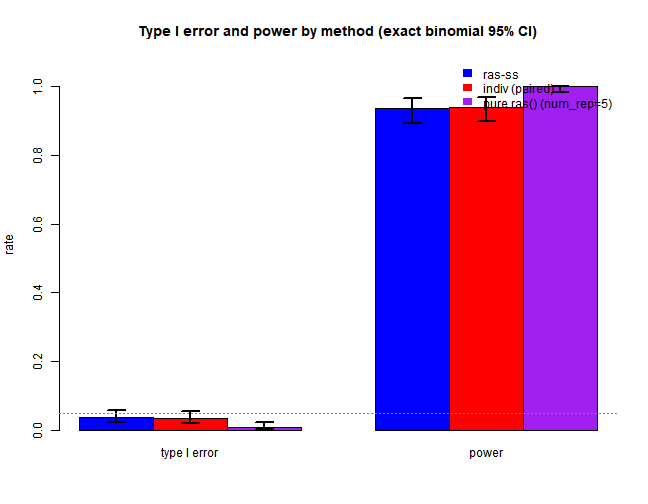
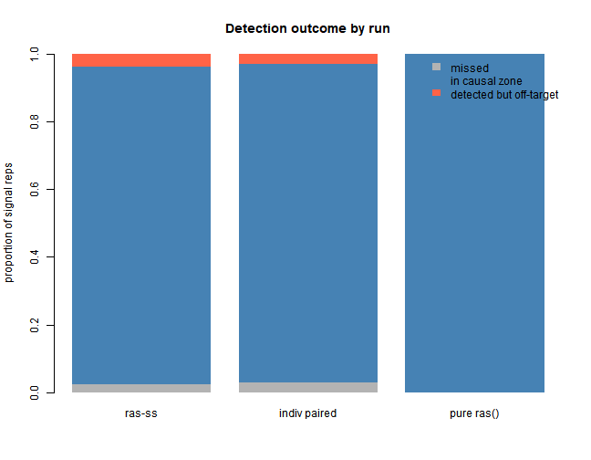
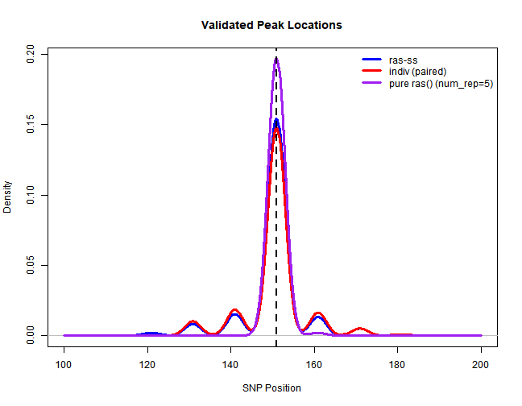

# Validation (300-SNP toy)

*Paired-data validation on the 300-SNP toy. The main paper-style study
is [Paper
Replication](https://anson-li8.github.io/rasSS/articles/paper-replication.md).*

Show code

``` r

knitr::opts_chunk$set(echo = TRUE)
knitr::opts_chunk$set(autodep = TRUE)
library(rasSS)
library(mvtnorm)
library(RAS)
library(future.apply)
plan(multisession)
source("code/ras_ss.R")
start_time <- Sys.time()
```

Show code

``` r

# run config
n_snps    <- 300
n_disc    <- 1000 # discovery cohort, method A (small for speed)
n_targ    <- 1000 # target cohort (small for speed)
rho       <- 0.8 # AR(1) correlation for LD
skip1           <- 10
skip2           <- 3
min_window_size <- 3
max_window_size <- 30
prune_r2        <- 0.2 # LD pruning
causal_snps  <- c(150, 151, 152)
effect_size  <- 0.5
slope_thresh   <- 1e-3
davies_thresh  <- 1e-3
base_seed      <- 35
best_ws        <- 12 # chosen via the window-size sweep in 01_simulation
R_true <- outer(1:n_snps, 1:n_snps, function(i, j) rho^abs(i - j))
set.seed(base_seed)
X_ref <- sim_genotypes(10000, R_true)
R_emp <- cor(X_ref)
prune_filter <- prune_ld(R_emp, prune_r2)
cat("Surviving SNPs after LD pruning:", sum(prune_filter), "of", n_snps, "\n")
null_beta   <- rep(0, n_snps)
signal_beta <- rep(0, n_snps)
signal_beta[causal_snps] <- effect_size
# did the validated peak land on the causal cluster (for power calculation)
in_zone <- function(tau) any(tau >= 130 & tau <= 170)
```

Show code

``` r

# rows 1 & 2 share the same simulated data per rep (paired test);
# row 3 runs the pure ras() function with num_rep = 5 (true published default)
n_null  <- 500
n_power <- 200

# rows 1 & 2: paired, same simulated data per rep
paired_null <- future_lapply(seq_len(n_null), function(s) suppressWarnings({
  r   <- one_rep(null_beta, seed = 100000 + s)
  ind <- indiv_scan(r$scan, r$X_t, r$y_t, r$b_disc)
  c(ss  = length(detect_peaks(r$scan, best_ws, scw = 8)$val$tau_hats) > 0,
    ind = length(detect_peaks(list(x = r$scan$x, y = ind), best_ws, scw = 8)$val$tau_hats) > 0)
}))

# for signal reps, also save profiles / tau positions for diag
paired_pow <- future_lapply(seq_len(n_power), function(s) suppressWarnings({
  r   <- one_rep(signal_beta, seed = 200000 + s)
  ind <- indiv_scan(r$scan, r$X_t, r$y_t, r$b_disc)
  ss_tau  <- detect_peaks(r$scan, best_ws, scw = 8)$val$tau_hats
  ind_tau <- detect_peaks(list(x = r$scan$x, y = ind), best_ws, scw = 8)$val$tau_hats
  list(ss_zone  = in_zone(ss_tau),
       ind_zone = in_zone(ind_tau),
       ss_tau   = ss_tau,
       ind_tau  = ind_tau,
       scan     = r$scan,
       ind_prof = ind)
}))

ss_n <- sapply(paired_null, `[`, "ss"); ind_n <- sapply(paired_null, `[`, "ind")
ss_p <- sapply(paired_pow, function(x) x$ss_zone); 
ind_p <- sapply(paired_pow, function(x) x$ind_zone)

# run 3: pure ras() with num_rep = 5 (closest to original)
pure_n <- unlist(future_lapply(seq_len(n_null), function(s)
            suppressWarnings(length(detect_peaks(native_run_via_ras(null_beta, 500000 + s),
                                               best_ws, scw = 8)$val$tau_hats) > 0)))
pure_p_tau <- future_lapply(seq_len(n_power), function(s)
            suppressWarnings(detect_peaks(native_run_via_ras(signal_beta, 600000 + s),
                                          best_ws, scw = 8)$val$tau_hats))
pure_p <- sapply(pure_p_tau, in_zone)
```

Show code

``` r

# per-rep runtime, single core, same reps for all three (fair algorithmic cost)
nb <- 10
bench <- function(f) mean(sapply(1:nb, function(s) system.time(f(s))["elapsed"]))
t_ras_ss <- bench(function(s) {
  r <- one_rep(signal_beta, 900000 + s)
  invisible(detect_peaks(r$scan, best_ws, scw = 8))
})
t_ind <- bench(function(s) {
  r <- one_rep(signal_beta, 910000 + s)
  invisible(detect_peaks(list(x = r$scan$x,
                              y = indiv_scan(r$scan, r$X_t, r$y_t, r$b_disc)),
                         best_ws, scw = 8))
})
t_pure_b <- bench(function(s) {
  invisible(detect_peaks(native_run_via_ras(signal_beta, 920000 + s), best_ws, scw = 8))
})
```

Show code

``` r

# format for table
fmt <- function(k, n) {
  b <- binom.test(sum(k), n)$conf.int
  sprintf("%.3f (%.3f-%.3f)", mean(k), b[1], b[2])
}
knitr::kable(data.frame(
  row   = c("ras-ss", "indiv (same data, paired)", "indiv (pure ras(), num_rep=5)"),
  type1 = c(fmt(ss_n, n_null),  fmt(ind_n, n_null),  fmt(pure_n, n_null)),
  power = c(fmt(ss_p, n_power), fmt(ind_p, n_power), fmt(pure_p, n_power)),
  time  = sprintf("%.2f s/rep", c(t_ras_ss, t_ind, t_pure_b)),
  reps  = c(paste0(n_null, " / ", n_power),
            paste0(n_null, " / ", n_power),
            paste0(n_null, " / ", n_power))
), caption = "Method comparison -- point estimate (exact binomial 95% CI), single-core sec/rep")
```

| row | type1 | power | time | reps |
|:---|:---|:---|:---|:---|
| ras-ss | 0.038 (0.023-0.059) | 0.935 (0.891-0.965) | 1.43 s/rep | 500 / 200 |
| indiv (same data, paired) | 0.036 (0.021-0.056) | 0.940 (0.898-0.969) | 2.11 s/rep | 500 / 200 |
| indiv (pure ras(), num_rep=5) | 0.010 (0.003-0.023) | 1.000 (0.982-1.000) | 4.14 s/rep | 500 / 200 |

Method comparison – point estimate (exact binomial 95% CI), single-core
sec/rep {.table}

Show code

``` r

# ras-ss seeds are unchanged, so this must reproduce 0.038 / 0.935
cat(sprintf("ras-ss repro check: type1 = %.3f (expect 0.038), power = %.3f (expect 0.935)\n",
            mean(ss_n), mean(ss_p)))
```

    ## ras-ss repro check: type1 = 0.038 (expect 0.038), power = 0.935 (expect 0.935)

Show code

``` r

# NOTE: time with knitr caching
cat(sprintf("Total knitting time: %.1f minutes\n",
            as.numeric(difftime(Sys.time(), start_time, units = "mins"))))
```

    ## Total knitting time: 47.0 minutes

Show code

``` r

# plot 0: the three-run comparison, w/ exact binomial 95% CI error bars
t1_counts <- c(sum(ss_n), sum(ind_n), sum(pure_n))
pw_counts <- c(sum(ss_p), sum(ind_p), sum(pure_p))
t1_ci <- sapply(t1_counts, function(k) binom.test(k, n_null)$conf.int)
pw_ci <- sapply(pw_counts, function(k) binom.test(k, n_power)$conf.int)
heights <- cbind(`type I error` = t1_counts / n_null,
                 power          = pw_counts / n_power)
rownames(heights) <- c("ras-ss", "indiv (paired)", "pure ras()")
lo_mat <- cbind(`type I error` = t1_ci[1, ], power = pw_ci[1, ])
hi_mat <- cbind(`type I error` = t1_ci[2, ], power = pw_ci[2, ])
bp <- barplot(heights, beside = TRUE, col = c("blue", "red", "purple"),
              ylim = c(0, 1.08), ylab = "rate",
              main = "Type I error and power by method (exact binomial 95% CI)")
for (i in 1:3) for (j in 1:2) {
  segments(bp[i, j], lo_mat[i, j], bp[i, j], hi_mat[i, j], lwd = 2)
  segments(bp[i, j] - 0.12, lo_mat[i, j], bp[i, j] + 0.12, lo_mat[i, j], lwd = 2)
  segments(bp[i, j] - 0.12, hi_mat[i, j], bp[i, j] + 0.12, hi_mat[i, j], lwd = 2)
}
abline(h = 0.05, lty = 3, col = "gray50")
legend("topright", fill = c("blue", "red", "purple"), border = NA, bty = "n",
       legend = c("ras-ss", "indiv (paired)", "pure ras() (num_rep=5)"))
```



plot of chunk diagnostics

Show code

``` r

# plot 1: detection outcome per run
outcome <- function(tau_list) {
  miss <- sapply(tau_list, function(t) length(t) == 0)
  inz  <- sapply(tau_list, in_zone)
  c(missed = mean(miss), in_zone = mean(inz), off_target = mean(!miss & !inz))
}
o <- rbind(`ras-ss`        = outcome(lapply(paired_pow, function(x) x$ss_tau)),
           `indiv paired`  = outcome(lapply(paired_pow, function(x) x$ind_tau)),
           `pure ras()`    = outcome(pure_p_tau))
barplot(t(o), col = c("grey70", "steelblue", "tomato"), border = NA,
        ylab = "proportion of signal reps", main = "Detection outcome by run",
        ylim = c(0, 1))
legend("topright", fill = c("grey70", "steelblue", "tomato"), border = NA,
       legend = c("missed", "in causal zone", "detected but off-target"), bty = "n")
```



plot of chunk diagnostics

Show code

``` r

# plot 2: where the validated peak landed, all three runs
ss_taus   <- unlist(lapply(paired_pow, function(x) x$ss_tau))
ind_taus  <- unlist(lapply(paired_pow, function(x) x$ind_tau))
pure_taus <- unlist(pure_p_tau)
bw_use <- 2   # shared
d_ss   <- density(ss_taus,   bw = bw_use, from = 100, to = 200)
d_ind  <- density(ind_taus,  bw = bw_use, from = 100, to = 200)
d_pure <- density(pure_taus, bw = bw_use, from = 100, to = 200)
plot(d_ss, col = "blue", lwd = 3, ylim = c(0, max(d_ss$y, d_ind$y, d_pure$y)),
     main = "Validated Peak Locations", xlab = "SNP Position")
lines(d_ind,  col = "red",    lwd = 3)
lines(d_pure, col = "purple", lwd = 3)
abline(v = 151, lty = 2, lwd = 2)
legend("topright", c("ras-ss", "indiv (paired)", "pure ras() (num_rep=5)"),
       col = c("blue", "red", "purple"), lwd = 3, bty = "n")
```



plot of chunk diagnostics
